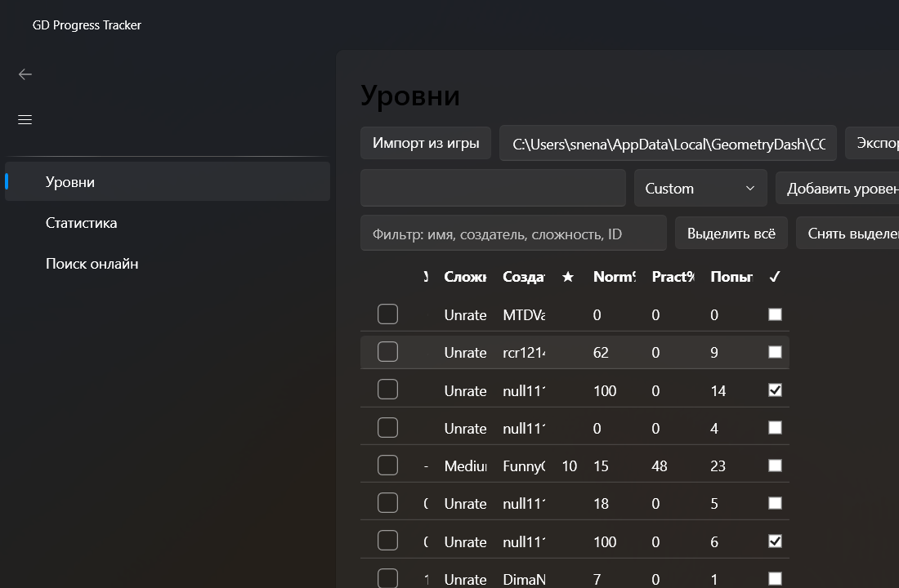

# GD Progress Tracker

Настольное приложение для Windows, которое ведёт учёт прогресса в Geometry Dash:
читает сейв-файл игры, хранит историю попыток по каждому уровню и строит графики
набранных звёзд и демонов. Всё остаётся на твоём компьютере.



Сайт проекта: <https://snenashev.github.io/gd-progress-tracker/>

## Возможности

- **Уровни** — список уровней с прогрессом, сложностью и числом попыток.
- **Прогрессы** — журнал попыток: когда и до какого процента дошёл.
- **Статистика** — графики звёзд, демонов и прочих счётчиков аккаунта.
- **Поиск онлайн** — поиск уровней на серверах Geometry Dash.
- **CPS-тест** — измерение скорости кликов.
- **Импорт и обмен** — импорт прогресса из игры, экспорт и импорт файла обмена.

## Установка

Скачай `GdTrackerSetup-<версия>.exe` со страницы
[Releases](https://github.com/snenashev/gd-progress-tracker/releases/latest) и запусти.

По умолчанию приложение ставится для текущего пользователя — права администратора
и UAC не нужны; в диалоге установки можно переключиться на установку для всех
пользователей. Удаляется штатно, через «Параметры → Приложения».

Требования: Windows 10/11, x64. Отдельно ставить .NET не нужно — рантайм входит
в поставку.

## Данные и приватность

- База: `%LOCALAPPDATA%\GdTracker\gdtracker.db` — обычный файл SQLite, его можно
  скопировать или открыть чем угодно. Удаление приложения его не трогает.
- Сейв игры (`%LOCALAPPDATA%\GeometryDash\CCGameManager.dat`) открывается только
  на чтение — приложение в него не пишет.
- Ни аккаунта, ни регистрации, ни телеметрии. Единственный сетевой запрос —
  поиск уровней на `boomlings.com`, и только когда ты сам его запускаешь.

## Сборка из исходников

Нужен [.NET SDK 10](https://dotnet.microsoft.com/download).

```powershell
dotnet build GdTracker.slnx
dotnet test  GdTracker.slnx
dotnet run --project src/GdTracker.App
```

### Инсталлятор

Нужен [Inno Setup 6](https://jrsoftware.org/isinfo.php):
`winget install --id JRSoftware.InnoSetup -e`.

```powershell
powershell -ExecutionPolicy Bypass -File installer/build.ps1
```

Скрипт публикует приложение как self-contained win-x64, компилирует
[installer/GdTracker.iss](installer/GdTracker.iss) и кладёт результат в
`installer/output/GdTrackerSetup-<версия>.exe`. Версия берётся из
[Directory.Build.props](Directory.Build.props) — единственного места, где она задана.

## Структура решения

| Проект | Назначение |
| --- | --- |
| `GdTracker.App` | Приложение на WPF (WPF-UI, LiveCharts) |
| `GdTracker.ViewModels` | Модели представления |
| `GdTracker.Core` | Модели предметной области и расчёты |
| `GdTracker.Data` | Хранилище на SQLite |
| `GdTracker.GameSync` | Чтение сейв-файла и поиск уровней онлайн |
| `GdTracker.Sharing` | Экспорт и импорт прогресса |
| `GdTracker.Tests` | Тесты |

## Лицензия

[MIT](LICENSE).
